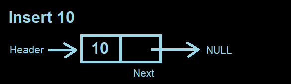
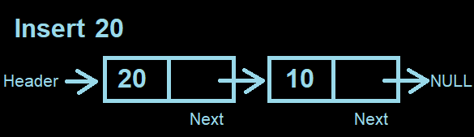

<h1 align="center">📄 README</h1>

# Data structures and algorithms
This repository contains implementations of various data structures and algorithms in the C programming language. 

The following data structures are currently available:

- Bubble Sort
- Merge Sort
- Quick Sort
- Quick Select
- Singly Linked List
- Hash Table
- Heap
- Binary Search Tree
- Balanced Binary Search Tree (AVL, Red Black)
- Graph or undirected Graph (Adjacency List, Adjacency Matrix)
- Digraph or directed Graph (Adjacency List, Adjacency Matrix)

## Bubble Sort

Bubble sort is a simple sorting algorithm that repeatedly steps through the list, compares adjacent elements and swaps them if they are in the wrong order. The algorithm is named for the way smaller or larger elements "bubble" to the top of the list.

## Quick Sort

Quick Sort is a fast sorting algorithm that uses a divide-and-conquer strategy to sort an array. It picks an element as a pivot and partitions the array around the pivot, such that all elements less than the pivot come before it and all elements greater than the pivot come after it. The pivot element is then placed in its final position and the algorithm is recursively applied to the sub-arrays.

## Quick Select

Quick Select is an efficient algorithm to find the k-th smallest element in an unsorted array of n elements. It is similar to Quick Sort, but instead of recursing into both sides, it only recurses into one side.

## Singly Linked List

A singly linked list is a linear data structure, in which the elements are not stored at contiguous memory locations. Each element of a linked list consists of two parts: the data and a reference to the next element.

### Main structure:
```c
typedef struct Node
{
    int value;
    struct Node* next;
} Node;

typedef struct LinkedList
{
    Node* header;
} LinkedList;
```

### Complexity
#### Time Complexity (Average)*
|Access|Search|Insertion|Deletion|
|---|---|---|---|
|O(n)|O(n)|O(1)|O(1)|

*If insertion and deletion is at the beginning.

#### Time Complexity (Worst)
|Access|Search|Insertion|Deletion|
|---|---|---|---|
|O(n)|O(n)|O(n)|O(n)|

#### Space Complexity
|Space|
|---|
|O(n)|

### Operation
### Insertion at the beginning:

1 - In the first time the singly linked list points to NULL:


2 - When inserting a new node, it becomes the new header of the list:



3 - So successively, because the insertion is at the beginning:



## Hash Table

A hash table is a data structure that can map keys to values. A hash table uses a hash function to compute an index into an array of buckets or slots, from which the desired value can be found.

### Linear-probing approach
A sufficiently large array where the elements are spread out to avoid collisions. It has less wasted space and better cache performance.

### Separate-chaining approach
An array of linked lists where the elements are spread out in the list. It is less sensitive to poorly-designed hash functions and avoids collisions better.

### Complexity
#### Time Complexity (Average)
##### Linear-probing, separate-chaining

|Access|Search|Insertion|Deletion|
|---|---|---|---|
|O(1)|O(1)|O(1)|O(1)|

#### Time Complexity (Worst)
##### Linear-probing, separate-chaining
|Access|Search|Insertion|Deletion|
|---|---|---|---|
|O(n)|O(n)|O(n)|O(n)|

#### Space Complexity
##### Linear-probing
|Space|
|---|
|O(n)|

##### Separate-chaining
|Space|
|---|
|O(m+n)|

## Binary Search Tree
A binary search tree is a data structure where each node has a key and an associated value that the key in any node is larger than the keys in all nodes in that node's left subtree and smaller than the keys in all nodes in that node's right subtree.

### Main structure:

```C
typedef struct Node
{
    int value;
    struct Node* left;
    struct Node* right;
} Node;
```
### Complexity
#### Time Complexity (Average)
|Access|Search|Insertion|Deletion|
|---|---|---|---|
|O(log n)|O(log n)|O(log n)|O(sqrt n)|

#### Time Complexity (Worst)
|Access|Search|Insertion|Deletion|
|---|---|---|---|
|O(n)|O(n)|O(n)|O(n)|

#### Space Complexity
|Space|
|---|
|O(n)|

## Balanced Binary Search Tree

### Main structure:
#### AVL
```C
typedef struct Node
{
    int value;
    int height;
    int factor;
    struct Node* left;
    struct Node* right;
} Node;
```

#### Red Black
```C
typedef enum { RED, BLACK } Color;

typedef struct Node
{
    int key;
    int value;
    Color color;
    struct Node* left;
    struct Node* right;
} Node;
```


### Complexity
#### Time Complexity (Average)
##### AVL, Red Black

|Access|Search|Insertion|Deletion|
|---|---|---|---|
|O(log n)|O(log n)|O(log n)|O(log n)|

#### Time Complexity (Worst)
##### AVL, Red Black
|Access|Search|Insertion|Deletion|
|---|---|---|---|
|O(log n)|O(log n)|O(log n)|O(log n)|

#### Space Complexity
|Space|
|---|
|O(n)|


## Graph and Digraph

### Graph
Set of vertices connected pairwise by edges.

### Digraph
Set of vertices connected pairwise by directed edges.


### Main structure:
#### Adjacency List
```C
typedef struct Node
{
    int value;
    struct Node* next;
} Node;

typedef struct LinkedList
{
    Node* header;
} LinkedList;

/* Graph or Digraph using Adjacency List */
typedef struct Graph
{
    int vertices;
    int edges;
    LinkedList* adjacencyList;
} Graph;
```
#### Adjacency List (Simplified)
```C
typedef struct Node
{
    int value;
    struct Node* next;
} Node;

/* Graph or Digraph using Adjacency List */
typedef struct Graph
{
    int vertices;
    Node** adjacencyList;
} Graph;

```
#### Adjacency Matrix
```C
/* Graph or Digraph using Adjacency Matrix */
typedef struct Graph
{
    int vertices;
    int** adjacencyMatrix;
} Graph;
```
### Complexity

#### Time Complexity (Average and Worst)
##### Adjacency List
Access|Search|Insertion|Deletion|
|---|---|---|---|
|O(n)|-|O(1)|O(degree)|

##### Adjacency Matrix
Access|Search|Insertion|Deletion|
|---|---|---|---|
|O(1)|-|O(1)|O(V)|

#### Space Complexity
##### Adjacency List
|Space|
|---|
|E+V|

##### Adjacency Matrix
|Space|
|---|
|V*V|

### Important algorithms

|Name|Problem|Time|Space|Graph or Digraph| Edge weight|
|---|---|---|---|---|---|
|DFS|Path|E+V|V|All|No|
|BFS|Shortest Path|E+V|V|All|No|
|Topological Sort|Shortest Path|V + E|V|Digraph|No|
|Bellman-Ford|Shortest Path|V(V + E)|V|Digraph|Yes|
|Floyd–Warshall|All-pairs shortest paths|V * V * V |V*V|Digraph|Yes|
|Dijkstra|Minimum spanning tree|E log V|V|All|Yes|
|Prim|Minimum spanning tree|E log V|V|Graph|Yes|
|Kruskal|Minimum spanning tree|E log E|E + V|Graph|Yes|


# Running the Program
To run the program, you will need to have a C compiler installed on your machine, such as GCC or Clang.